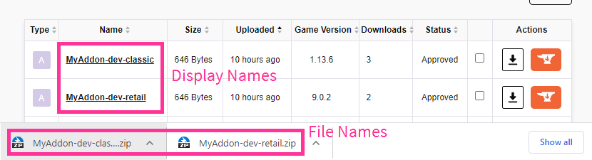

.. _commands:

Commands
========

The definitive documentation for ``wap`` commands lives in its help text. See it with:

.. code-block:: console

   $ wap --help
   $ wap build --help
   $ wap dev-install --help
   etc...

This document aims to supplement that help text and provide links to other related content.

.. _wap-quickstart:

``quickstart``
--------------

Start your new addon project by creating a directory structure suitable for most projects.

.. code-block:: text

   Usage: wap quickstart [OPTIONS] PROJECT_DIR_PATH

   Options:
   --help  Show this message and exit.

This command is interactive, and will ask you some questions about your project.

If you
plan on uploading to CurseForge, make sure you have project page open as reference.
``wap`` will ask you questions that you should answer from data on that page. Or,
`create a new project`_.

Example:

.. code-block:: console

   $ wap quickstart MyAddon

will create a new directory named ``MyAddon`` in your
current directory. Don't worry too much about your answers -- you can always change
things in your :ref:`configuration <configuration>`.

The directory structure will look something like this:

.. code-block::

   MyAddon
   ├── MyAddon
   |   └── Init.lua
   ├── CHANGELOG.md
   ├── README.md
   └── .wap.yml

This project is literally all ready to go. Some sample code has even been placed in the
``Init.lua`` to get you started. It is :ref:`build <wap-build>`-able,
:ref:`install <wap-dev-install>`-able, and :ref:`upload <wap-upload>`-able.

.. _wap-build:

``build``
---------

Build your addon.

.. code-block:: text

   Usage: wap build [OPTIONS]

   Options:
   -c, --config-path PATH    The path of the configuration file. May also be
                             specified in the environment variable
                             WAP_CONFIG_PATH.  [default: (.wap.yml)]

   -v, --addon-version TEXT  The developer-defined version of your addon
                             package.  [default: dev]

   -j, --json                Output json to stdout of the operations wap
                             performed (so it can be written to files or piped
                             to other programs)

   --help                    Show this message and exit.

For each :ref:`wow-version <config-wow-versions>` specified in your config, create a
build directory and zip file containing your packaged addon in the ``dist/`` directory
(relative to your current directory). The contents of the build directory and zip file
will be the same as the :ref:`dir paths <config-dirs-path>` you provide in your
config, plus an additional generated TOC file.

The format of the name of the build directory will be
``<addon-name>-<addon-version>-<wow-version-type>``. It is the same for the zip file,
except a ``.zip`` extension is added:

* ``addon-name`` comes from your :ref:`config-name` in your config
* ``addon-version`` comes from the command line argument ``--addon-version``. It
  defaults to ``dev`` if it is not provided.
* ``wow-version-type`` is either ``retail`` or ``classic``. This comes from the type
  of versions in the :ref:`config-wow-versions` of your config.

Each TOC file generated will have the same name as the directory (plus the ``.toc`` extension).
If this file exists in your source directory, it will be overrwritten.

See :ref:`toc-gen` for more information.

For example, running:

.. code-block:: console

   $ wap build

with a config file like:

.. code-block:: yaml

   name: MyAddon
   wow-versions:
     - 9.0.2
     - 1.13.6
   dirs:
     - path: MyDir
     # ...

will create these directories and files:

.. code-block::

   dist
   ├── MyAddon-dev-retail/
   |   └── MyDir
   |       ├── MyDir.toc
   |       └── (other files in MyDir source dir)
   ├── MyAddon-dev-classic/
   |   └── MyDir
   |       ├── MyDir.toc
   |       └── (other files in MyDir source dir)
   ├── MyAddon-dev-retail.zip
   └── MyAddon-dev-classic.zip

.. warning::

   You should not be editing the files in the ``dist`` directories. If you need to change
   something, change it in your source files.

.. _wap-dev-install:

``dev-install``
---------------

Install a built addon to the provided WoW addons directory.

.. code-block:: text

   Usage: wap dev-install [OPTIONS]

   Options:
   -c, --config-path PATH          The path of the configuration file. May also
                                   be specified in the environment variable
                                   WAP_CONFIG_PATH.  [default: (.wap.yml)]

   -v, --addon-version TEXT        The developer-defined version of your addon
                                   package.  [default: dev]

   -j, --json                      Output json to stdout of the operations wap
                                   performed (so it can be written to files or
                                   piped to other programs)

   -w, --wow-addons-path WOW_ADDONS_PATH
                                   Your WoW addons path. May also be specified
                                   in the environment variable
                                   WAP_WOW_ADDONS_PATH.  [required]

   --help                          Show this message and exit.

.. note::
   You must have :ref:`built <wap-build>` your addon before you run this command. If
   you have built with a particular addon version (``--addon-version``), you must use
   that same version here.

This command assists you in testing your addons quickly.

``wap`` is smart in determining which addon build to install (retail or classic). It
looks at the components of the WoW addons directory path provided and chooses the
appropriate one.

The provided WoW addons directory must *appear to be* valid, or else wap will not
perform the installation. This is to avoid data loss in unintended directories.
The actual logic for this is to inspect the path components of the directory provided,
which must end with the following in order:

#. ``World of Warcraft``
#. either ``_retail_`` or ``_classic_``
#. ``Interface``
#. ``AddOns``

.. note::
   The parts of the WoW addons directory are evaluated with case sensitivity.

For example, ``C:\Program Files (x86)\World of Warcraft\_retail_\Interface\AddOns`` (Windows) or
``/Applications/World of Warcraft/_retail_/Interface/AddOns`` (macOS) are acceptable.

Example:

.. tab:: Windows

   .. code-block:: console

      $ wap dev-install "C:\Program Files (x86)\World of Warcraft\_retail_\Interface\AddOns"

.. tab:: macOS

   .. code-block:: console

      $ wap dev-install "/Applications/World of Warcraft/_retail_/Interface/AddOns"

.. warning::
   If your addon's directories already exist in the WoW addons directory, they will
   first be deleted to ensure a clean install. Keep this in mind if you have somehow
   put important data in that directory.

.. _wap-upload:

``upload``
----------

Upload built addons to your addons Curseforge page.

.. code-block:: text

   Usage: wap upload [OPTIONS]

   Options:
     -c, --config-path PATH          The path of the configuration file. May also
                                     be specified in the environment variable
                                     WAP_CONFIG_PATH.  [default: (.wap.yml)]

     -j, --json                      Output json to stdout of the operations wap
                                     performed (so it can be written to files or
                                     piped to other programs)

     -v, --addon-version TEXT        The developer-defined version of your addon
                                     package.  [required]

     -r, --release-type [beta|alpha|release]
                                     The type of release to make.  [default:
                                     alpha]

     --curseforge-token TEXT         The value of your CurseForge API token. May
                                     also be specified in the environment
                                     variable WAP_CURSEFORGE_TOKEN.  [required]

     --changelog-contents TEXT       The contents of your changelog that will be
                                     displayed with your upload on CurseForge. If
                                     you have also provided a changelog-file in
                                     your config, this option will take
                                     precedence. There are no requirements for
                                     these contents -- they may be blank if you
                                     wish. Must be used in conjunction with
                                     --changelog-type.

     --changelog-type [text|markdown|html]
                                     The format of your changelog contents. Must
                                     be used in conjunction with --changelog-
                                     contents.

     --help                          Show this message and exit.

.. note::
   You must have :ref:`built <wap-build>` your addon before you run this command. If
   you have built with a particular addon version (``--addon-version``), you must use
   that same version here.

Each build of your addon (retail and/or classic) with the given addon version will be
uploaded. An addon version is **required** from you for this command. This is to ensure
that your uploads are intentional, which are released to the Internet.

In addition to the options set for this command and your configuration, ``wap``
automatically sets some metadata to send with the request.

* The display name. This is the name of the file as it appears on your addon's files
  page. ``wap`` sets this to ``<addon-name>-<addon-version>-<wow-version-type>``
* The zip file name. This is the file name of the that users download. wap sets this to
  ``<addon-name>-<addon-version>-<wow-version-type>.zip``

(``addon-name``, ``addon-version``, ``wow-version-type`` have the same meaning as they
do in :ref:`build <wap-build>`.)

.. _wap-new-config:

``new-config``
--------------

Create a new :ref:`configuration file <configuration>` with some pre-filled data.

.. code-block:: text

   Usage: wap new-config [OPTIONS]

   Options:
   -c, --config-path PATH  The path of the configuration file to create.
                           [default: (.wap.yml)]

   --help                  Show this message and exit.

To avoid data loss, this path must not exist.

This command is interactive, and is similar to :ref:`quickstart <wap-quickstart>`,
except it does not create any files except the configuration.

This command targeted towards existing projects that want to start using ``wap`` or
projects that want to migrate from another packager.

More than likely, you will need to edit this configuration file to fit to your
project. This just provides a starting point.

.. _wap-validate:

``validate``
------------

Validates a wap :ref:`configuration file <configuration>`.

.. code-block:: text

   Usage: wap validate [OPTIONS]

   Options:
   -c, --config-path PATH  The path of the configuration file. May also be
                           specified in the environment variable
                           WAP_CONFIG_PATH.  [default: (.wap.yml)]

   -j, --json              Prints the config file in JSON format.
   --help                  Show this message and exit.

An exit code of 0 means the validation was successful. Otherwise, the error
encountered is displayed and the exit code is non-zero.

.. note::

   Successful validation does not indicate that any other ``wap`` command will work. It
   merely means that there were no errors parsing the configuration file.

.. _`create a new project`: https://www.curseforge.com/project/1/1/create