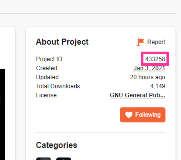

.. _configuration:

Configuration
-------------

``wap`` only needs one file to operate: a YAML file named ``.wap.yml``. This file should
 be placed at the root of your project directory.

For new YAML authors, see `What is YAML?`_.

For advanced YAML authors, it may be important to note that ``wap`` uses a subset of
YAML called `strictyaml`_. This provides benefits for both you and ``wap``, but does
`restrict some buggy YAML features`_.

Paths in your configuration file
********************************

Some of your configuration will include paths to files related to your project. It
is important to note the following:

* All paths are treated as POSIX paths. The main takeaway
  of this is that path separators (the slashes between directories and subdirectories
  and files) are **forward slashes** (``/``). By choosing a standard, configuration
  files become cross-platform, so developers on any other system can contribute to your
  project.

  .. code-block:: yaml

    path/to/my.lua    # GOOD, only forward slashes
    path\to\my.lua    # bad, uses backslashes
    path/to\my.lua    # bad, uses mixed slashes

* All paths are relative paths. (Absolute paths are not allowed because they would be
  unique to your system).

Sample Config File and Directory Structure
******************************************

Here's a commented sample ``.wap.yml`` file:

.. code-block:: yaml

  # the name of your package, can be anything you like
  name: MyAddon

  # a list of versions of WoW your addon works on
  wow-versions:
    - 9.0.2
    - 1.13.6

  # if you want to upload to CurseForge, include this section
  curseforge:

    # found on your project page
    project-id: 123456

    # change history file, optional
    changelog-file: CHANGELOG.md

    # found from your CurseForge URL
    # ex: https://www.curseforge.com/wow/addons/myaddon -> "myaddon"
    project-slug: myaddon

  # a list of addons that will be packaged up
  addons:

      # an addon directory
    - path: MyDir  # an addon directory

      # TOC generation
      toc:

        # metadata about your addon for WoW
        tags:
          Title: MyAddon
          Notes: A great addon for WoW
          Author: Me
          X-CustomTag: CustomValue

        # the files to load, in order, for your addon, as found inside MyDir
        files:
          - Init.lua
          - MySubDir/Sub.lua

And heres a project structure that this config could work with:

.. code-block:: text

   MyProject                # your project directory
   ├── MyAddon              # an addon directory (addons[*].path in config)
   |   ├── Init.lua         # a Lua code file (addons[*].toc.files in config)
   |   └── MySubDir         # a subdirectory in your addon directory
   │       └── Sub.lua      # another Lua code file (addons[*].toc.files in config)
   ├── CHANGELOG.md         # changelog file (curseforge.changelog in config)
   ├── README.md            # readme documentation
   └── .wap.yml             # configuration file

Syntax
******

.. _config-name:

``name``
^^^^^^^^

**Required**. The name of your project. This will be used to name the build
directories and zip files for your package (as well as the zip file users download on
CurseForge).

You can name this anything you want.

Example:

.. code-block:: yaml

  name: MyAwesomeAddon

.. _config-wow-versions:

``wow-versions``
^^^^^^^^^^^^^^^^

**Required**. A ``list`` of the versions of World of Warcraft that your package supports.
``wap`` will create different package builds for each version in the output directory.

Each version must be in the form ``x.y.z``, where ``x``, ``y``, and ``z`` are
non-negative integers.

You must at least supply one of these, and can at most supply two (for retail and
classic).

You should list **current** WoW versions. Otherwise, your addon may
be disabled when users install it.

``wap`` uses these versions for a few things:

- To build your package for each version (with the correct ``## Interface`` tag in TOC files).
- To mark on CurseForge which version your package supports.
- To ``dev-install`` the right package build into the right WoW AddOns path. For example a
  *classic* addon build should not go into a *retail* AddOns directory.

Examples:

.. code-block:: yaml

  # just retail
  wow-versions:
    - 9.0.2

.. code-block:: yaml

  # just classic
  wow-versions:
    - 1.13.6

.. code-block:: yaml

  # retail and classic
  wow-versions:
    - 9.0.2
    - 1.13.6

.. warning::
  You do need to ensure these versions are actaully valid WoW versions, or else
  uploads to CurseForge will fail.

  One surefire way of getting a valid version is looking at the Battle.net Launcher
  and looking at the first 3 digits of the version list there:

  .. image:: _static/valid-wow-version.png
     :alt: A version in the Battle.net Launcher

``curseforge``
^^^^^^^^^^^^^^

A ``map`` of configuration options for CurseForge. If you want to upload your project to
CurseForge, you must include this section.

``curseforge.project-id``
^^^^^^^^^^^^^^^^^^^^^^^^^

**Required**. The project id as found on your CurseForge addon's page. This field tells wap
what addon page to upload to.

Example:

.. code-block:: yaml

  curseforge:
    project-id: 433258
    # ...

``curseforge.changelog-file``
^^^^^^^^^^^^^^^^^^^^^^^^^^^^^

The path, relative the parent directory of the configuration file, of your changelog file.
This file should contain a helpful history of changes to your addon over time. There are no
requirements for the contents of this file -- it just needs to exist. You may leave
it blank if you're just starting out.

.. note::
  **This field is optional in your configuration**. But if you do not provide it, you must use the
  ``--changelog-contents`` and ``--changelog-type`` options when you run the
  :ref:`upload command <wap-upload>`: Curseforge requires this data. It accompanies each file uploaded to the site.

  CurseForge aside, maintaining a changelog file is a good practice. This is helpful
  information for both your users and collaborators.

See the `Sample Config File and Directory Structure`_ section for an example on where
this file is expected to be inside your project.

The CurseForge API also requires a changelog type, which indicates the format of your
log contents. They support the following:

- ``markdown``
- ``html``
- ``text``

``wap`` will try to choose the correct format based on the extension of the file you
provide for this field. It does so according to the following mapping:

+-----------------+-------------------+
| File Extension  | Changelog Type    |
+=================+===================+
| ``.md``         | ``markdown``      |
+-----------------+-------------------+
| ``.markdown``   | ``markdown``      |
+-----------------+-------------------+
| ``.html``       | ``html``          |
+-----------------+-------------------+
| ``.txt``        | ``text``          |
+-----------------+-------------------+
| All other cases | ``text``          |
+-----------------+-------------------+

Example:

If you had a project structure like this:

.. code-block::

   MyProject
   ├── MyAddon
   ├── CHANGELOG.md
   └── .wap.yml

then you would fill in this field like this:

.. code-block:: yaml

  curseforge:
    changelog-file: CHANGELOG.md
    # ...

``curseforge.project-slug``
^^^^^^^^^^^^^^^^^^^^^^^^^^^

**Required**. The string of the name of your addon as it is found in your addon's CurseForge
URL.

While not strictly necessary, this helps ``wap`` provide better output for you in the
form of URLs that you can copy-paste into your browser after you upload.

Example:

If your projects's URL is ``https://www.curseforge.com/wow/addons/mycooladdon``, then you
would fill in this field like this:

.. code-block:: yaml

  curseforge:
    project-slug: mycooladdon
    # ...

``addons``
^^^^^^^^^^

**Required**. A ``list`` of addons to include in your build.

.. warning::

   You only need multiple ``addons`` entries when you want to package **multiple addons
   that have different TOC files**. Some authors use this structure when they need to
   give an addon different `loading conditions`_, for example. This is, more or less,
   an advanced concept.

   **Most projects only need a single** ``addons`` **entry.** If you do not know if
   you need multiple ``addons``, you more than likely **do not**.

   If you simply want a logical separation of files, create subdirectories within your
   addon directory.

.. _config-addons-path:

``addons[*].path``
^^^^^^^^^^^^^^^^^^

**Required**. The path, relative the parent directory of the configuration file, of the
directory to include in your packaged addon.

This cannot be a file -- it must be a directory because only directories are installable
into WoW addons folders.

Example:

If you had a project structure like this:

.. code-block::

   MyProject
   ├── MyAddon
   ├── MyOtherAddon
   └── .wap.yml

then you would fill in this field like this:

.. code-block:: yaml

  addons:
    - path: MyAddon
    # ...
    - path: MyOtherAddon
    # ...

.. _config-addons-toc:

``addons[*].toc``
^^^^^^^^^^^^^^^^^

**Required**. The configuration for this addon's generated TOC file. The generated
TOC file will have the same name as the base name of the addon directory
(plus the ``.toc`` extension).

See :ref:`toc-gen` for more information.

.. _config-addons-toc-tags:

``addons[*].toc.tags``
^^^^^^^^^^^^^^^^^^^^^^

**Required**. A ``map`` of key-value pairs to include in the generated TOC file. The keys and values
will be interpreted as strings.

Use this section to provide things like the ``Title``, ``Notes`` (description), and
any other WoW-specified tags. A full list of supported tags may be found at the
`WoW Gamepedia TOC format article`_.

Custom tags can be added too, and should be prefixed with ``X-``.

.. note::
  **You should not provide the** ``Interface`` **and** ``Version`` **tags!** ``wap`` generates
  those tags for you. You can override them, but it is not recommended.

.. _config-addons-toc-files:

``addons[*].toc.files``
^^^^^^^^^^^^^^^^^^^^^^^

**Required**. A ``list`` of file paths, relative to the addon path,
that specify the Lua (or XML) files your addon should load. The order of this sequence
is respected in the generated TOC file.

See the `Sample Config File and Directory Structure`_ section for an example on where
these files are expected to be inside your project and how to write their paths.

.. _`strictyaml`: https://hitchdev.com/strictyaml/
.. _`What is YAML?`:  https://blog.stackpath.com/yaml/
.. _`restrict some buggy YAML features`: https://hitchdev.com/strictyaml/#design-justifications
.. _`WoW Gamepedia TOC format article`: https://wow.gamepedia.com/TOC_format
.. _`loading conditions`: https://wow.gamepedia.com/TOC_format#Loading_conditions