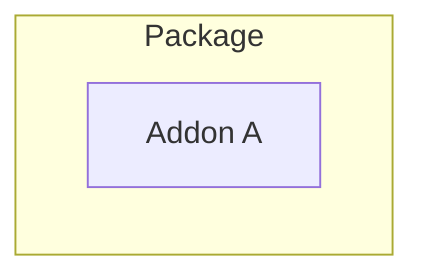
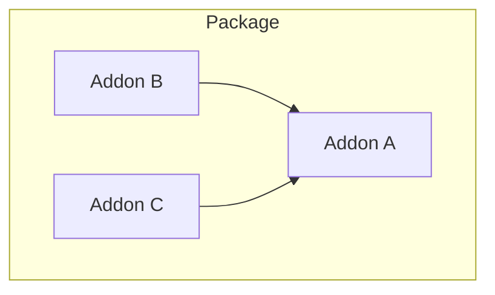

# Project Structure

`wap` builds *packages*. A package is a group of addons which will be distributed together.

If you're just starting out, your package will only have one addon:



Larger projects will contain several addons with interconnected dependencies:



However complex, `wap` can handle it.

## Recommended File Layout

In your project root, you should keep your `wap.json` configuration file and your addon directories.

```text
MyProject/
├─── Addon A/
│    ├─── Main.lua
│    └─── Other.lua
├─── README.md
└─── wap.json
```